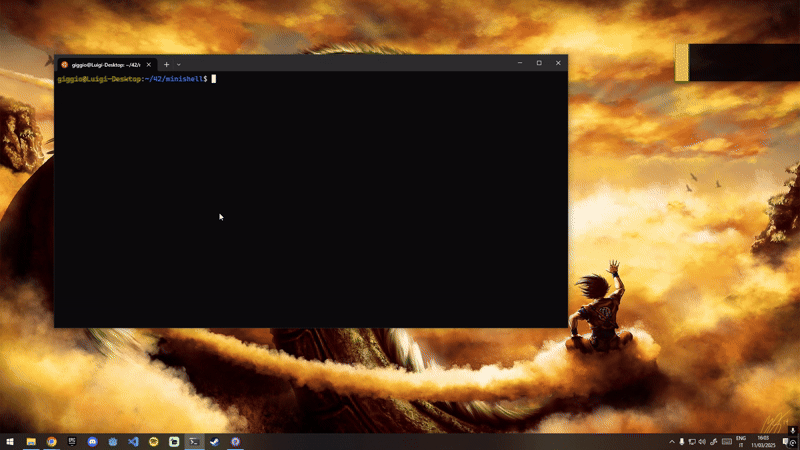

# Minishell  

Minishell is a simple Unix shell developed in C, designed to replicate the basic behavior of Bash by implementing essential features such as command execution, environment variable handling, redirections, pipes, and built-in commands.  

## Main Features  

- **Interactive prompt** with command history support  
- **Command execution** via absolute path, relative path, or using the `PATH` environment variable  
- **Signal handling:**  
  - `Ctrl+C`: displays a new prompt  
  - `Ctrl+D`: exits the shell  
  - `Ctrl+\`: ignored  
- **Environment variable expansion** (`$VAR_NAME`) and exit status expansion (`$?`)  
- **Quote handling:**  
  - `'` (single quotes) prevent meta-character expansion  
  - `"` (double quotes) prevent expansion except for `$`  
- **Redirections:**  
  - `<` redirects input  
  - `>` redirects output  
  - `<<` (heredoc) reads input until a specified delimiter is encountered  
  - `>>` appends output to a file  
- **Pipes (`|`)** to connect the output of one command to the input of the next  
- **Implemented built-in commands:**  
  - `echo` (with `-n` option)  
  - `cd` (only with absolute or relative paths)  
  - `pwd`  
  - `export`  
  - `unset`  
  - `env`  
  - `exit`  

Minishell was developed with a structured and modular approach, avoiding the use of multiple global variables for signal handling, ensuring better robustness and maintainability.  

